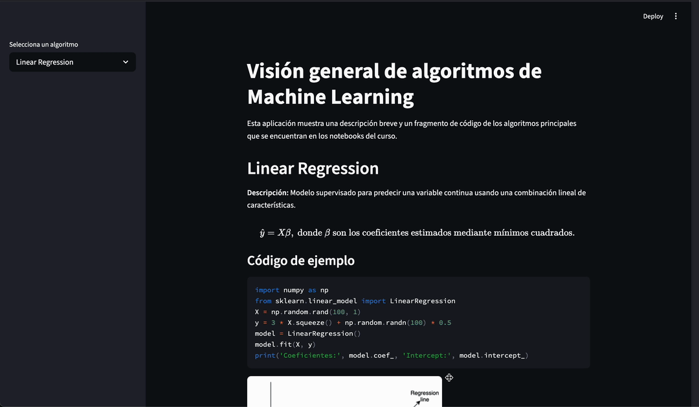

# 📚 Habilidades adquiridas con los Jupyter Notebooks

A lo largo del curso he trabajado en una serie de notebooks que cubren los conceptos y técnicas más relevantes de la **Inteligencia Artificial** y el **Machine Learning**. Cada notebook está pensado como una guía práctica que combina teoría, visualizaciones y código ejecutable. Las principales competencias que he desarrollado son:

## 🧩 Manipulación y análisis de datos

- **NumPy**: manejo eficiente de arrays, operaciones vectorizadas y generación de datos sintéticos.
- **Pandas**: carga, limpieza, transformación y exploración de datasets reales (CSV, JSON, HTML).  
- **Matplotlib & Seaborn**: visualización de distribuciones, correlaciones y resultados de modelos.

## 📈 Modelado supervisado

- **Regresión lineal** y **regresión logística**: ajuste de parámetros, interpretación de coeficientes y evaluación con métricas de error y exactitud.
- **Support Vector Machines (SVM)**: selección de kernels, margen máximo y validación cruzada.
- **Árboles de decisión** y **Random Forest**: construcción de modelos de clasificación, extracción de importancia de variables y tuning de hiperparámetros.
- **Isolation Forest**: detección de anomalías en datos multivariados.
- **Redes neuronales (MLP)**: diseño de capas ocultas, función de pérdida y proceso de entrenamiento.

## 📊 Modelado no supervisado y reducción de dimensionalidad

- **K‑Means** y **DBSCAN**: clustering basado en distancia y densidad, interpretación de clusters y detección de ruido.
- **PCA (Análisis de Componentes Principales)**: reducción de dimensionalidad, visualización de data proyectada en 2‑D.
- **Selección y extracción de características**: técnicas para identificar variables relevantes y construir pipelines reproducibles.

## 🛠️ Herramientas y buenas prácticas

- **Scikit‑learn**: pipeline de pre‑procesado → transformador → estimador, uso de `GridSearchCV` y `cross_val_score`.
- **Pipeline y ColumnTransformer**: encadenamiento de transformaciones para datos heterogéneos.
- **Manejo de datasets desequilibrados**: técnicas de sub‑muestreo y sobre‑muestreo.
- **Evaluación de modelos**: matrices de confusión, ROC‑AUC, curvas de aprendizaje.
- **Documentación y reproducibilidad**: notebooks estructurados con markdown, celdas de código claras y visualizaciones explicativas.

# 🚀 ¿Para qué sirve la aplicación Streamlit?

La aplicación **`app.py`** (Streamlit) es una interfaz web interactiva que resume todo lo aprendido en los notebooks. Su objetivo principal es:


1. **Mostrar un catálogo rápido de algoritmos** – mediante una barra lateral, se puede seleccionar cualquier algoritmo estudiado.
2. **Presentar información clave** – descripción breve, fórmula matemática (renderizada con LaTeX) y fragmento de código listo para copiar.
3. **Ilustrar visualmente** – se incluyen imágenes representativas (`images/*.png`) que resumen gráficamente el comportamiento del algoritmo.
4. **Facilitar la exploración** – ideal para repasar conceptos, enseñar a otros o como referencia rápida durante el desarrollo de nuevos proyectos.

Esta app no pretende reemplazar los notebooks completos, sino ofrecer una **ventana de referencia** ligera y accesible desde el navegador.

# 📂 Estructura del proyecto

```
.
├─ app.py                 # Aplicación Streamlit
├─ README.md              # Este archivo
├─ images/                # Figuras usadas en la app
├─ notebooks/             # Jupyter notebooks del curso
│   ├─ 1_Introducción a NumPy.ipynb
│   ├─ 2_Introducción a Pandas.ipynb
│   ├─ ...
│   └─ 22_Redes Neuronales Artificiales.ipynb
├─ .venv/                 # Entorno virtual (no versionado)
└─ pyproject.toml         # Dependencias del proyecto
```

# 🛠️ Instalación y ejecución

```bash
# 1. Clonar el repositorio (si aún no lo tienes)
git clone https://github.com/LuisFHernadezV/machine_laerning_skills.git
cd curso_machine_learning

# 2. Crear y activar entorno virtual
uv venv
source .venv/bin/activate   # Linux/macOS
# .venv\Scripts\activate   # Windows

# 3. Instalar dependencias
uv sync

# 4. Ejecutar la aplicación Streamlit
streamlit run app.py
```

Abre tu navegador en la URL que Streamlit indica (usualmente `http://localhost:8501`).

# 📖 Cómo usarla

1. En la barra lateral, elige el algoritmo que deseas explorar.
2. Lee la descripción, observa la fórmula en LaTeX y revisa el ejemplo de código.
3. Descarga la imagen o copia el fragmento de código para probarlo en tus propios notebooks.

# ✨ Conclusión

Este repositorio combina **aprendizaje teórico** (notebooks) con **visualización interactiva** (Streamlit), proporcionando una herramienta completa para consolidar y compartir los conocimientos adquiridos en inteligencia artificial y machine learning.
